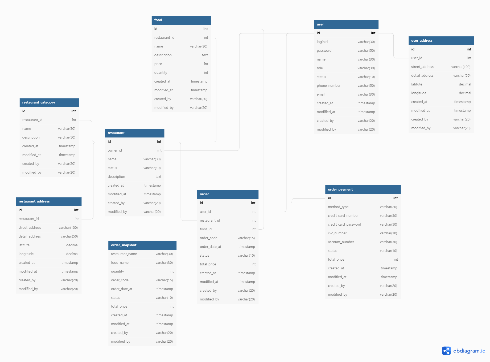

# FOOD-RUN

음식 배달 서비스 입니다. 음식점의 메뉴를 선택해 집 앞으로 배달하는 서비스입니다.

## 사용 기술 및 개발 환경

- Java 17
- Spring Boot 2.6.7
- IntelliJ
- gradle
- MyBatis
- MySQL

## 개발 규칙

- [Java Coding Convention](https://github.com/f-lab-edu/food-run/wiki/3.Convention#java-coding-convention)
- [Git Branch 전략](https://github.com/f-lab-edu/food-run/wiki/3.Convention#git-branch-%EC%A0%84%EB%9E%B5)
- [Git Commit Message Convention](https://github.com/f-lab-edu/food-run/wiki/3.Convention#commit-message-convention)
- 목표 테스트 커버리지 : 70%

|| 테스트 커버리지 |                브랜치 커버리지                |
|:--------:|:--------------------------------------:|:------------------------------------------------------------------------------------------------------------:|
|  현재 수치   |  ||

## 주요 기능

- [기능 정리](https://github.com/f-lab-edu/food-run/wiki/1.Home#2-%EA%B8%B0%EB%8A%A5-%EC%86%8C%EA%B0%9C)
- [유스케이스](https://github.com/f-lab-edu/food-run/wiki/2.Use-Case)

## ERD

- [ERD 원본 - diagram.io](https://dbdiagram.io/d/627e692a7f945876b61451b4)

